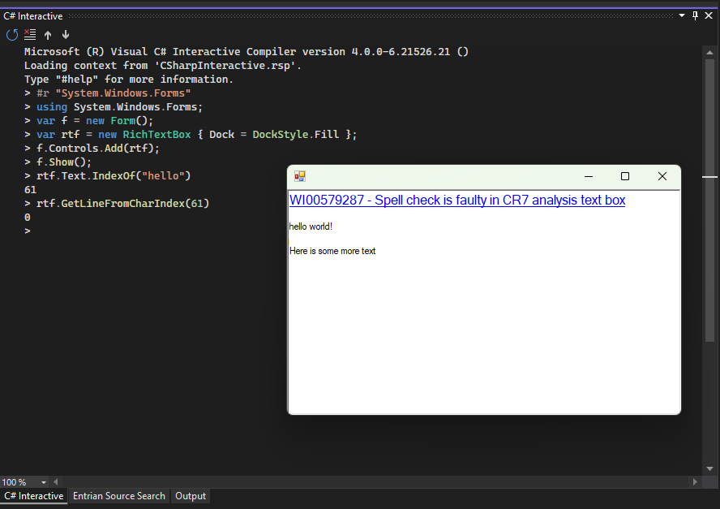
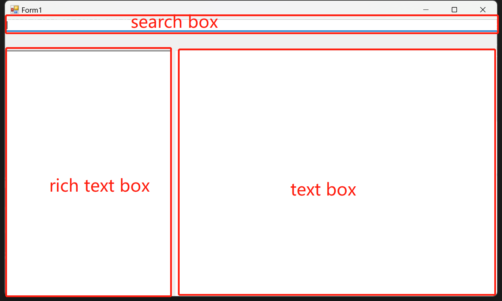
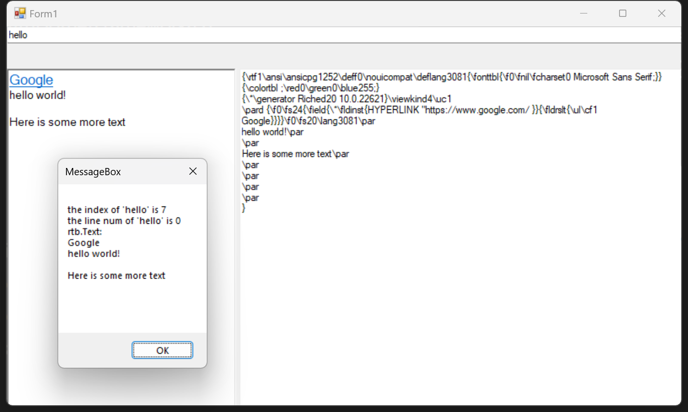
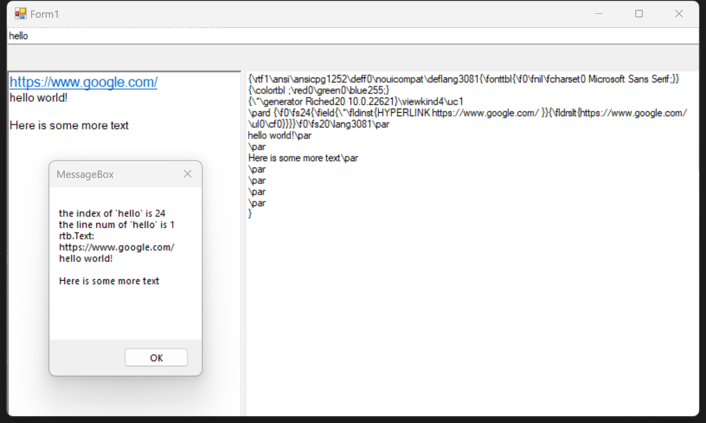
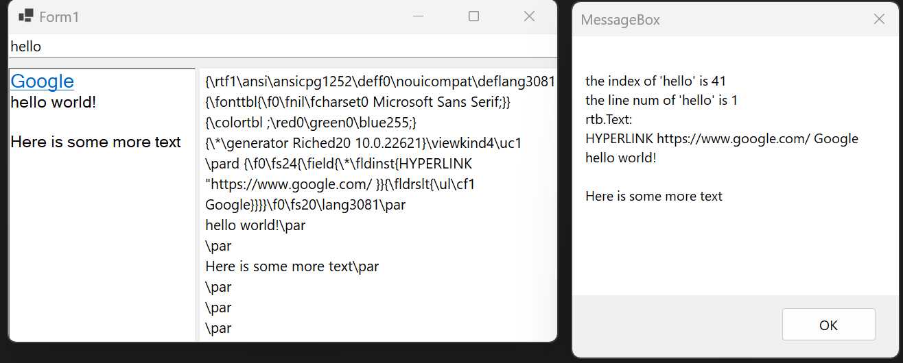
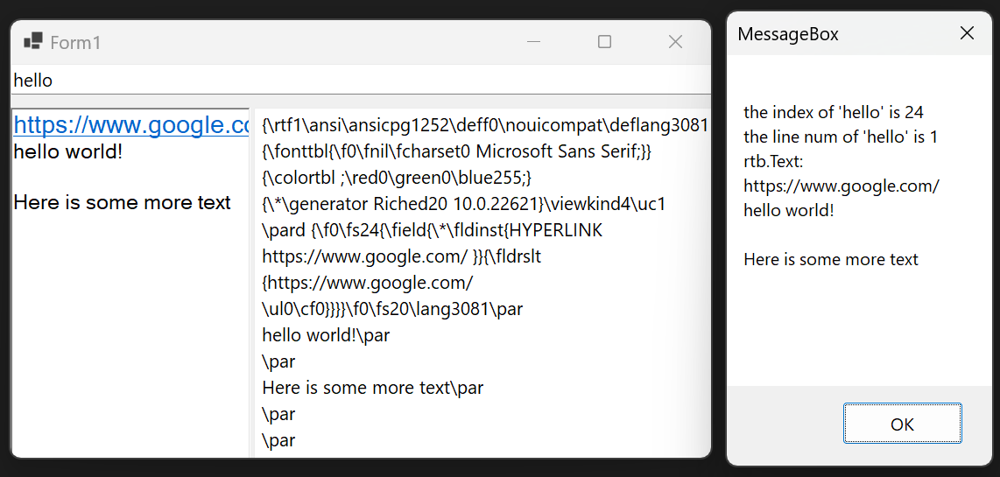

# GetLineFromCharIndexIssueDemo

This is a demo of `GetLineFromCharIndex()` issue.

The link to the report is [this](https://developercommunity.visualstudio.com/t/GetLineFromCharIndex-return-an-error-res/10314554).

Moved this [issue](https://github.com/dotnet/winforms/issues/8885) to [dotnet/winforms](https://github.com/dotnet/winforms).

## Issue

Pasting a hyperlink into a rich text box will cause the characters after the hyperlink to return an error result when using `GetLineFromCharIndex()`.

## Reproduce the issue in IssueDemoWithDotnetFramework4.8

When run this demo, you will get this form:

- search box: Enter the content you want to search in the search box and press enter, it will return:
  - key word's index in the Text of rich text box
  - the line number returned by `GetLineFromCharIndex`
  - the Text of rich text box
- rich text box: Enter the content in the rich text box and display its corresponding rtf content in the text box
- text box: Entering rtf content in the text box will show its rendered appearance in the rich text box.

There are two rft files here:

- [RTF-w-link-and-text-same-hyperlink.rtf](./RTF-w-link-and-text-same-hyperlink.rtf)
- [RTF-w-link-and-text-different-hyperlink.rtf](./RTF-w-link-and-text-different-hyperlink.rtf)

What you need to do is:

1. Open [RTF-w-link-and-text-different-hyperlink.rtf](./RTF-w-link-and-text-different-hyperlink.rtf) with Notepad
2. Copy the content and paste it into text box
3. Search in the search box, for example "hello"

You will see that:

You will find that the line number returned is wrong.

You can also try using [RTF-w-link-and-text-same-hyperlink.rtf](./RTF-w-link-and-text-same-hyperlink.rtf).

Everything is OK.

## Reproduce the issue in IssueDemoWithDotnet6

Everything is very similar, just running in a different version. So I'll just paste in the results of the run.

Using [RTF-w-link-and-text-different-hyperlink.rtf](./RTF-w-link-and-text-different-hyperlink.rtf)

It seems that Text has some problems.

Using [RTF-w-link-and-text-same-hyperlink.rtf](./RTF-w-link-and-text-same-hyperlink.rtf).

Everything is OK.
